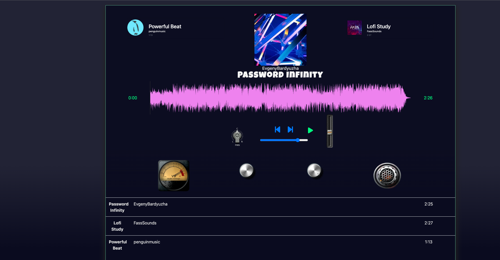
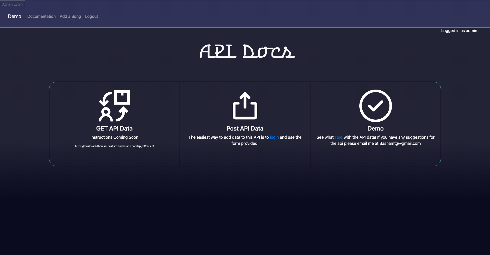
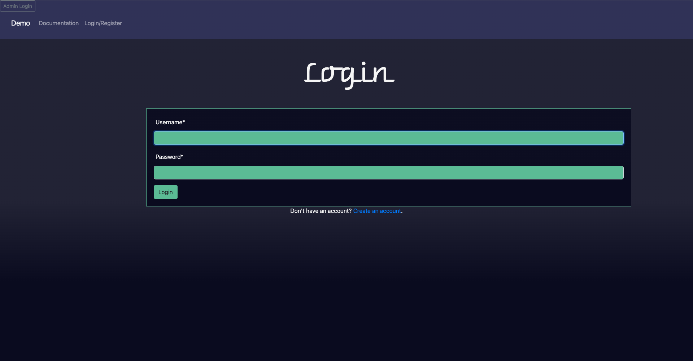
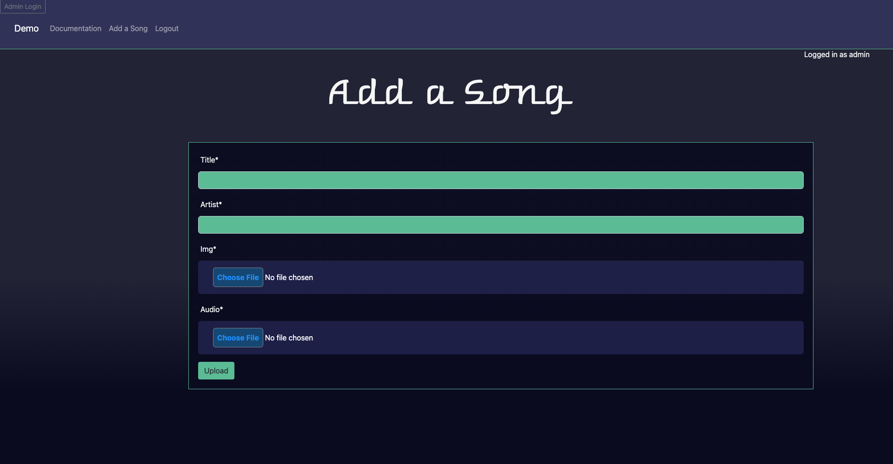

# Music API

**Author:** Thomas Basham

## [music-api-bashamtg.vercel.app](https://music-api-bashamtg.vercel.app)

A Full Stack API for storing favorite music

Built with Django Rest Framework, PostgreSQL, Paginator, and Cloudinary bucket for user file uploads

### Resources

[Wavesurfer-js](https://wavesurfer-js.org/)

[Web Audio Controls](https://g200kg.github.io/webaudio-controls/docs/knobgallery.html)

[How to Upload Files to S3 Using Django Storages](https://www.youtube.com/watch?v=nzLMA9WZqMM&t=152s)

[Royalty Free Music](https://pixabay.com/music)